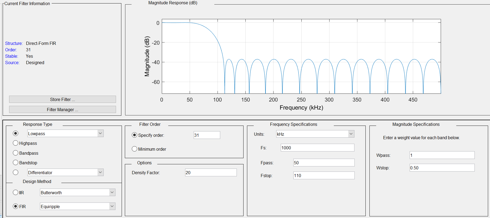
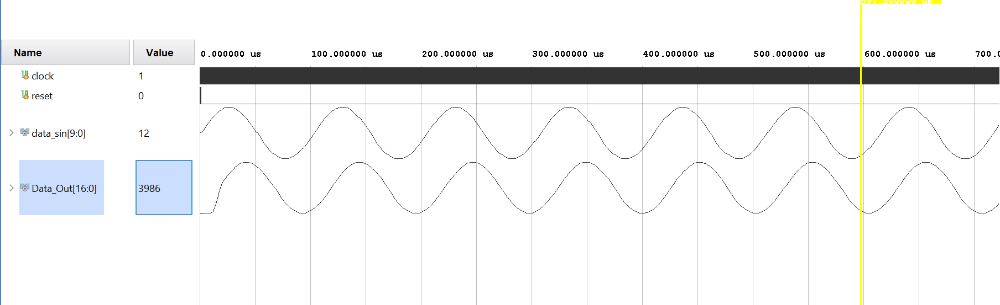

# Low-Pass FIR Filter 

Designing a system that acts as a low-pass filter in Verilog.

## Tools Used
- Filter Design & Analysis Tool (``FDATool``) in ``MATLAB 2023a``.
- ``Xilinx Vivado v2020.1`` for designing and synthesizing the system.

## Code

### Designing the Low-Pass Filter 
To obtain the filter coefficients, MATLAB's FDATool was used. These were the design parameters:

  

Along with this, I applied some other preprocessing steps before using these values;
  1. Replace all negative values with zeros.
  2. Scale all numbers by a factor of ``255``. This number was chosen because all coefficients had to be represented in 8 bits according to the specifications
  3. Round all numbers to the nearest integer.
     
### Convolution 
To apply the filter, the input signal was simply shifted after every multiplication and accumulation operation.

## Input Signals & Results
The input signals for this task were obtained from the output of a [Direct Digital Synthesizer](https://github.com/samiyaalizaidi/Direct-Digital-Synthesizer). 

The input signals along with their filtered output are shown below. According to the parameters, all frequencies below 50KHz should be allowed to pass, and all frequencies above 110Khz should be completely blocked.

For 10KHz:

  

For 40Khz:

  

For 125Khz:

  

For 250Khz:

  

---

**Contributions**: All of the code in this repository is written by [Samiya Ali Zaidi](https://github.com/samiyaalizaidi).
